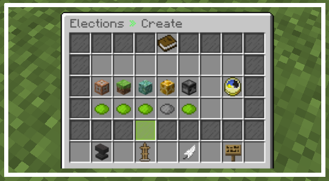
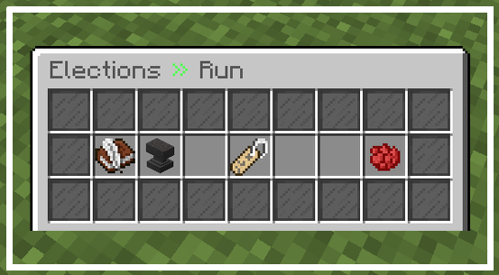
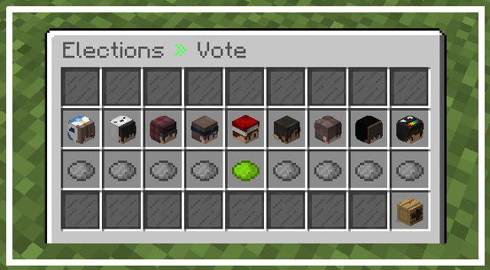
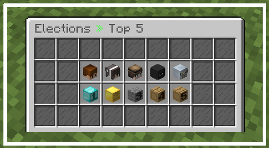

# Elections   [](https://discord.com/invite/Nt467Rf)


## Introduction

**Elections** is a simple plugin that lets you create elections. Modify the election settings, till your happy and then
the plugin does the rest for you! In these elections, you can nominate yourself, vote for other players and find out who
the best player truly is.

## Features

+ Awesome **scoreboard**
+ **GUI** for creating elections
+ 100% **custom messages**
+ Fancy titles
+ Really easy way to create elections:
    1) Set the position players are going to be running for
    2) Set the time of each phase
    3) Let players nominate themselves
    4) Each player can set their own status
    5) Unlimited players can nominate themselves
    6) Option to set the maximum amount of players who can nominate themselves
    7) Everybody can vote for these players and determine who the best player is
    8) See the top 5 players
+ Automatically continue elections after server stop/restart
+ When an election is over, the winner is declared
+ Automatically run commands when the election finishes

## Screenshots









## Commands

### Admin Commands:

- `/elections create`: Opens a GUI for creating an election
- `/elections skipStage`: Skip to the next stage [Nomination Phase » Voting Phase » Finish Election]
- `/elections cancel`: Cancel the current election

### Player Commands:

- `/elections help`: Elections Help-Command
- `/elections run`: Nominate yourself for the election [Nomination Phase]
- `/elections vote`: Vote for the best player [Voting Phase]
- `/elections top5`: See the top five players [Voting Phase & after election]

## Permissions

| **Permission**        | **Default** |
|-----------------------|-------------|
| `elections.create`    | *op*        | 
| `elections.cancel`    | *op*        | 
| `elections.run`       | *true*      | 
| `elections.skipstage` | *op*        | 
| `elections.vote`      | *true*      | 

## Setup

### After purchase

1. Buy & Download the **Elections** plugin
2. Place the plugin in you **plugins** directory
3. Start up your server
4. If a file called "elections.data" is created, just ignore this. (It's required to resume the election after the
   server stops/restarts)

### In-game

1. Create an election with `/elections create`
2. During the **Nomination Phase**, all players (with permission) can nominate themselves with `/election run`
3. After the Nomination Phase (in the **Voting Phase**), all players (with permission) can vote for their favourite
   player with `/elections vote

## Developer API

**Maven:**

```xml

<repository>
  <id>eintosti-releases</id>
  <url>https://repo.eintosti.de/releases</url>
</repository>
```

```xml

<dependency>
  <groupId>de.eintosti</groupId>
  <artifactId>elections-api</artifactId>
  <version>version</version>
</dependency>
 ```

**Or alternatively, with Gradle:**

```kotlin
repositories {
  maven {
    url = uri("https://repo.eintosti.de/releases")
  }
}

dependencies {
  compileOnly("de.eintosti:buildsystem-api:version")
}
```

## Contributing

### To compile...

#### On Windows

1. Shift + right-click the folder with the directory’s files and click "Open command prompt".
2. `gradlew clean build`

#### On Linux, BSD, or Mac OS X

1. In your terminal, navigate to the folder with directory’s files (cd /folder/of/buildsystem/files)
2. `./gradlew clean build`

### Then you will find...

* the **Elections** plugin jar `Elections-<identifier>` in **/build/libs**

### Other commands

* `gradlew idea` will generate an [IntelliJ IDEA](https://www.jetbrains.com/idea/) module for each folder.
* `gradlew eclipse` will generate an [Eclipse](https://www.eclipse.org/downloads/) project for each folder. _(Possibly
  broken!)_

### PR Policy

I'll accept changes that make sense. You should be able to justify their existence, along with any maintenance costs
that come with them.

## License

This project is licensed under the [GNU General Public License v3.0](LICENSE.txt).